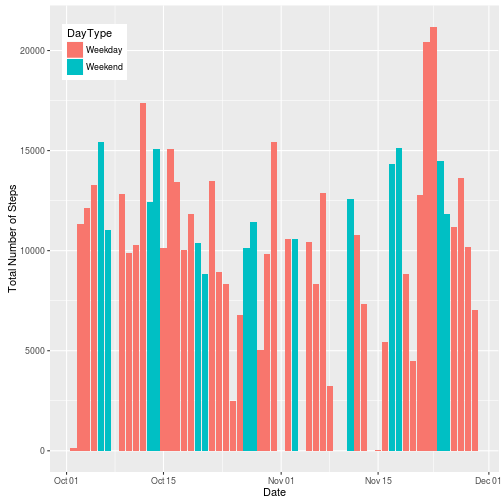
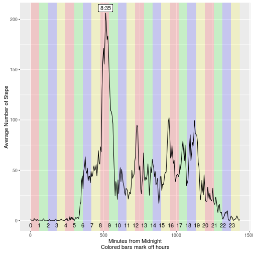
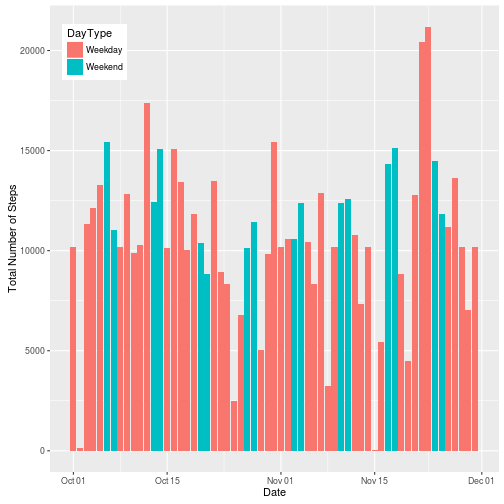
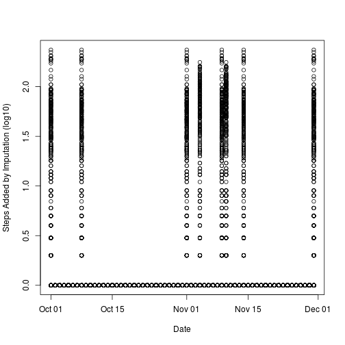
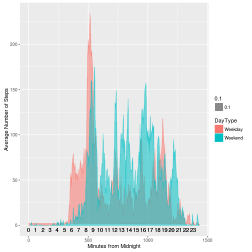

[Course Project 1][Coursera] from Coursera

The input data are not included in this directory in the interest of
saving planetary resources. You may
[find the zip file here][SourceData]. If you want to play with the raw
R code, it is segregated in [its own file](./PA1_template.R)


```r
## Basic libraries:
library('ggplot2')
library(hash)
```

## Loading and preprocessing the data

The `$interval` field is poorly constructed. Between the start and end
of each hour (that is, between minute 59 and minute 60) the interval
jumps by 41, rather than 1. Presumably this is to make the distinction
between hours an minutes more clear, but it does horrible things to
plots (40 minute discontinuities). I have added the `$minutes` field
to correctly capture the time axis.


```r
input <- "activity.csv"
iCls  <- c("integer", "character", "integer")
data  <- read.csv( file = input, stringsAsFactors = FALSE,
    colClasses = iCls)
data$date <- as.Date( data$date )

## Fix the goofy intervals. They jump by 100 instead of 60
## Make a properly-continuous minute interval:
data$minutes <- vapply( data$interval, function(x) {
    hr = as.integer(x / 100)
    min = x - hr * 100
    hr * 60 + min
}, 0)
## Also generate pretty-print versions of the time (H:MM)
data$time <- vapply( data$interval, function(x) {
    hr = as.integer(x / 100)
    min = x - hr * 100
    sprintf("%d:%02d", hr, min)
}, "")
## Finally add a weekend flag
data$DayType <- factor(ifelse(weekdays(data$date) %in%
                              c("Saturday", "Sunday"),
                              "Weekend", "Weekday"),
                       levels = c("Weekday","Weekend" ))
```

## What is mean total number of steps taken per day?


```r
## ggplot can automatically aggregate for us. But this makes
## computing the mean easier. I think.
stepsByDay <- aggregate( steps ~ date + DayType, data, sum )
p <- ggplot(stepsByDay, aes(date)) +
    geom_bar( aes(weight = steps, fill = DayType )) +
    labs(x = "Date", y = "Total Number of Steps")
p + theme(legend.position = c(0.1,0.9))
```



```r
datSum <- summary(stepsByDay$steps, na.rm = TRUE)
```

On average, 1.077 &times; 10<sup>4</sup> steps are taken each day, with a median
of 1.076 &times; 10<sup>4</sup>.


## What is the average daily activity pattern?


```r
stepsByInterval <- aggregate( steps ~ minutes + time + interval,
                             data, mean, na.rm = TRUE )
## Hourly markers for labels
stepsByInterval$Hour <- vapply( stepsByInterval$minutes, function(x) {
    ifelse(x %% 60, "", as.character(x / 60))
}, "")

## http://docs.ggplot2.org/current/annotation_raster.html
## Put in bars on the background to highlight hours
colorHours <- rep(c("red","green", "blue","yellow"), 6)
## Increase the transparency so the bars are not so stark
transCH <- rgb(t(col2rgb(colorHours)), alpha = 40, maxColorValue = 255)

p <- ggplot(stepsByInterval, aes(x = minutes, y = steps)) +
    ## The hour bars:
    annotation_raster( matrix(transCH, nrow = 1), 0,
                      max(stepsByInterval$minutes), -Inf, Inf) +
    geom_line( )  +
    labs(x = "Minutes from Midnight\nColored bars mark off hours",
        y = "Average Number of Steps")

## Find the time that the most steps occurs at
with( stepsByInterval, {
    maxInd  <<- which.max(steps) 
    maxTime <<- time[ maxInd ]
    maxInt  <<- interval[ maxInd ]
} )

## Add in the 24 hour labels and the time at max steps
p  + geom_text(label = stepsByInterval$Hour, y = -5 ) +
    geom_label(label = maxTime, x = stepsByInterval$minutes[maxInd],
               y = stepsByInterval$steps[maxInd] + 5 )
```



Our protagonist is getting insufficient sleep, roughly 6 hours. S/he
is most active in the morning between 5:30-9:30am. Maximum steps occur
at interval 835 (8:35). After the morning spike, s/he
settles into modest activity until 7pm, and goes to bed sometime
between 10 and midnight.

## Imputing missing values

I am taking averages for data clustered by interval and weekday
vs. weekend. These averages are then stored in a hash structure for
efficient (I hope) lookup and substitution in the original data
structure.


```r
imputationAggregation <-
    aggregate( steps ~ DayType + interval, data, mean, na.rm = TRUE )

## I am skeptical that subsetting will be efficient here. I am going
## to make a hash to store these values
imputationLookup <- hash()
for (i in 1:nrow(imputationAggregation)) {
    imputationLookup[[ paste(imputationAggregation$DayType[i],
                             imputationAggregation$interval[i]) ]] <-
        ## Round to keep it an integer
        round(imputationAggregation$steps[i])
}

imputed <- data
for (i in 1:nrow(imputed)) {
    if (is.na(imputed$steps[i])) imputed$steps[i] <-
        imputationLookup[[ paste(imputed$DayType[i],
                                 imputed$interval[i]) ]]
}
```

2304 rows had missing data. After
imputation, 2304 incomplete rows were imputed, leaving
0 rows with `NA` values.

#### Filling out imputed values


```r
impByDay <- aggregate( steps ~ date + DayType, imputed, sum )
p <- ggplot(impByDay, aes(date)) +
    geom_bar( aes(weight = steps, fill = DayType )) +
    labs(x = "Date", y = "Total Number of Steps",
         main = "Steps by day, using imputed data")
p + theme(legend.position = c(0.1,0.9))
```



```r
impSum <- summary(impByDay$steps, na.rm = TRUE)
```

Following imputation, on average, 1.076 &times; 10<sup>4</sup> steps are taken
each day (change of -10), with a
median of 1.057 &times; 10<sup>4</sup> (change of
-190)


#### Specific changes due to imputation

Graphical view of imputed step values, organized by date


```r
## Directly compare the two plots. We need to turn the NAs into zeros:
dInds <- 1:length(data$steps)
repInds <- dInds[ is.na(data$steps) ]
plot(x = data$date, y = log10(imputed$steps -
                              replace(data$steps, repInds, 0)+1),
     xlab = "Date", ylab = "Steps Added by Imputation (log10)")
```



## Are there differences in activity patterns between weekdays and weekends?


```r
## We'll use the imputed values for this:
stepsByIntType <- aggregate( steps ~ minutes + DayType,
                             imputed, mean, na.rm = TRUE )
## Hourly markers for labels
stepsByIntType$Hour <- vapply( stepsByIntType$minutes, function(x) {
    ifelse(x %% 60, "", as.character(x / 60))
}, "")


## the polygon connects the first and last points, which is kind of
## irritating. I don't know a simple way to just drop the shading to
## the x-axis.
p <- ggplot(stepsByIntType, aes(x = minutes, y = steps)) +
    geom_polygon( aes(alpha = 0.1, fill = DayType, col = DayType))  +
    labs(x = "Minutes from Midnight",
        y = "Average Number of Steps")

## Add in the 24 hour labels and the time at max steps
p  <- p + geom_text(label = stepsByIntType$Hour, y = -5 )
```

Our subject sleeps in longer on the weekend, waking sometime between
5-8am. The flurry of morning activity is comparable to a weekday, but
they are much more active during the course of the day. There is a
conserved noon-time spike, presumably for lunch, but three additional
periods of activity from 10-12, 1-3pm, and 3-6pm. Additionally, there
is a late night weekend spike in activity from 8-10pm.




[SourceData]: https://d396qusza40orc.cloudfront.net/repdata%2Fdata%2Factivity.zip
[Coursera]: https://www.coursera.org/learn/reproducible-research/peer/gYyPt/course-project-1
